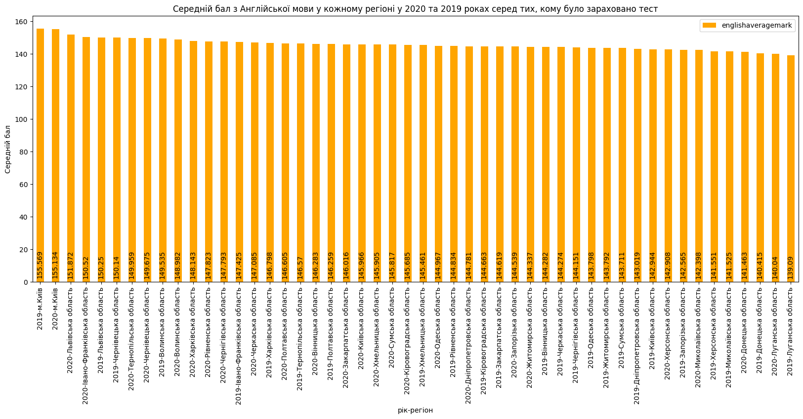

## Налаштування віртуального середовища та запуск

В окремому терміналі/консолі запустіть

- `docker-compose up`

В браузері відкрийте PGAdmin: http://localhost:8081

- Логін та пароль до PGAdmin: `admin@kpi.ua`, `admin`
- Логін та пароль до сервера: `postgress`
- Host name: `db`

Потім послідовно виконайте наступні команди:

- Linux/MacOS

```bash
python3 -m pip install virtualenv
python3 -m venv bd_env
source bd_env/bin/activate
source .env
python3 -m pip install -r requirements.dev
python3 main.py
```

- Windows

```
py -m pip install --user virtualenv
py -m venv bd_env
.\bd_env\Scripts\activate
py -m pip install -r requirements.txt
py main.py
```

## Опис програми

### Підключення до бази

При запуску команди `source .env` були створені змінні середовища операційної системи з інформацією для підключення до
бази даних (назва бази, порт і т.п.). Програма зчитує ці змінні й створює підключення за допомогою функції
psycopg2.connect

### Створення таблиць

Програма створює дві таблиці за допомогою запитів, що наведені в файлах:

1. [CreateStudentTable.sql](./queries/CreateStudentTable.sql)
2. [CreateSubjectTable.sql](./queries/CreateSubjectTable.sql)
3. [CreateLastRowTable.sql](./queries/CreateLastRowTable.sql)

В першій таблиці зберігається інформація про людину, що складала ЗНО (унікальний ідентифікатор, рік народження, рік
складання іспиту, місце прописки та т.п.). В другій — інформація про результат за іспит з певного предмета певної
людини (ідентифікатор людини, назва предмету, місце складання, оцінка і т.п.), де ідентифікатор є зовнішнім ключем до
унікального ідентифікатора з першої таблиці.

### Вставка даних

Далі програма зчитує з файлів Odata2019File.csv та Odata2020File.csv дані по рядках і записує їх в таблиці
(через якість даних це робиться за допомогою ~~поганого коду~~ магії). Кожну 50-ту ітерацію (кожен 50-й рядок)
виконується cursor.commit (закінчення транзакції) а в таблицю LastRowTable записується поточний рядок, час роботи
програми до моменту до поточного часу і рік за який беруться дані.

### Переривання та відновлення роботи

При перериванні з'єднання з базою (це можна викликати штучно виконавши команду `docker-compose down`) програма закінчує
свою роботу, а при наступному її запуску з таблиці LastRowTable беруться значення року та номер рядка, що був записаний
останнім, і продовжується запис починаючи з цього рядку. Також для підрахунку часу фактичного виконання запису даних з
файлу у базу з цієї таблиці береться значення часу, скільки виконувалась програма до "падіння".

__Наприклад__, програма виконувалась 10 хвилин, а тоді з'єднання з базою перервалося. Ми її перезапустили й вона
закінчила роботу за 20 хвилин. Тоді час виконання програми буде розрахований як 10 + 20 = 30 хв без урахування часу, що
пройшов між "падінням" і перезапуском програми.

### Запит

Завдання: `Варіант 14: Порівняти середній бал з Англійської мови у кожному регіоні у 2020 та 2019 роках серед тих кому було зараховано тест`
Програма виконує запит відповідно до завдання і записує результат у форматі _csv_ в файл `resultFile.csv`. Результатом
цього запиту э таблиця з трьома колонками:

- назва регіону
- рік
- середній бал

### Logs

Протягом усієї роботи програма записує свої дії у файл [database_logs.log](./database_logs.log). Також на початку і в
кінці роботи фіксується час, тому останній запис у цьому файлі — час виконання усієї програми
(див. приклад в пункті "Переривання та відновлення роботи")

## Результати виконання

### Таблиці

Перші чотири рядки та стовпці з таблиці StudentTable та SubjectTable

outid|birth|sextypename|regname
--- |--- |--- |--- 
"0000333b-1b93-4386-a148-3d9613bbe324"  |  2002   | "жіноча"  |  "Донецька область"...
"0000333c-efa3-42a7-9f45-e77b53346d57"    | 2002    | "чоловіча"    | "Донецька область"...
"000034f9-ecb8-4e84-bf2e-715d83d79bc8"    | 2003    | "жіноча"    | "Чернігівська область"...
"00003fa1-de6c-488e-a130-8acf4fb817ef"    | 2002    | "жіноча"    | "Сумська область"...

outid|subjtype|test|teststatus
--- |--- |--- |---
"0000333b-1b93-4386-a148-3d9613bbe324"|    "hist"    |"Історія України"    |"Не подолав поріг"
"0000333b-1b93-4386-a148-3d9613bbe324"|    "Ukr"    |"Українська мова і література"    |"Зараховано"
"0000333c-efa3-42a7-9f45-e77b53346d57"|    "hist"    |"Історія України"    |"Зараховано"
"0000333c-efa3-42a7-9f45-e77b53346d57"|    "math"    |"Математика"    |"Зараховано"

### Гістограма



### Logs example

```
2021-03-05 17:56:51,696 INFO __main__::create_tables: Creating tables 
2021-03-05 17:56:51,697 INFO __main__::create_tables: Table StudentTable already exists 
2021-03-05 17:56:51,698 INFO __main__::create_tables: Table SubjectTable already exists 
2021-03-05 17:56:51,700 INFO __main__::create_tables: Table LastRowTable already exists
2021-03-05 17:56:51,702 INFO __main__::main: Starting inserting from 0 row from file for 0 year 
2021-03-05 17:56:51,702 INFO __main__::main: Start time 2021-03-05 17:56:51.702203 
2021-03-05 17:56:51,702 INFO __main__::insert_data: Inserting data from Odata2019File.csv 
2021-03-05 17:57:38,590 INFO __main__::insert_data: Break time 2021-03-05 17:57:38.590443
2021-03-05 17:57:38,590 INFO __main__::insert_data: Executing time 0:00:46.888240 
2021-03-05 17:57:38,590 INFO __main__::insert_data: Я упал: server closed the connection unexpectedly
	This probably means the server terminated abnormally
	before or while processing the request.

2021-03-05 17:59:30,936 INFO __main__::create_tables: Creating tables 
2021-03-05 17:59:30,938 INFO __main__::create_tables: Table StudentTable already exists 
2021-03-05 17:59:30,938 INFO __main__::create_tables: TableSubjectTable already exists 
2021-03-05 17:59:30,941 INFO __main__::create_tables: Table LastRowTable already exists
2021-03-05 17:59:30,942 INFO __main__::main: Starting inserting from 52100 row from file for 2019 year
.
.
.
```